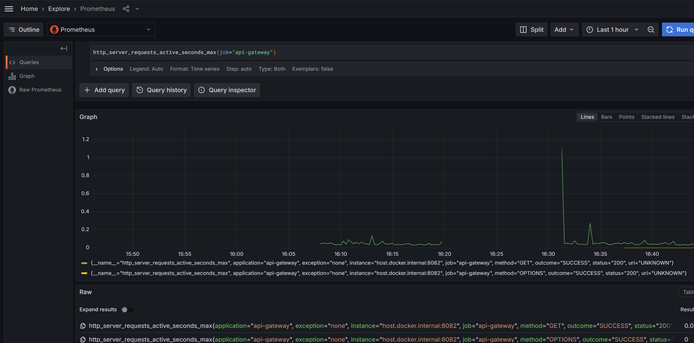
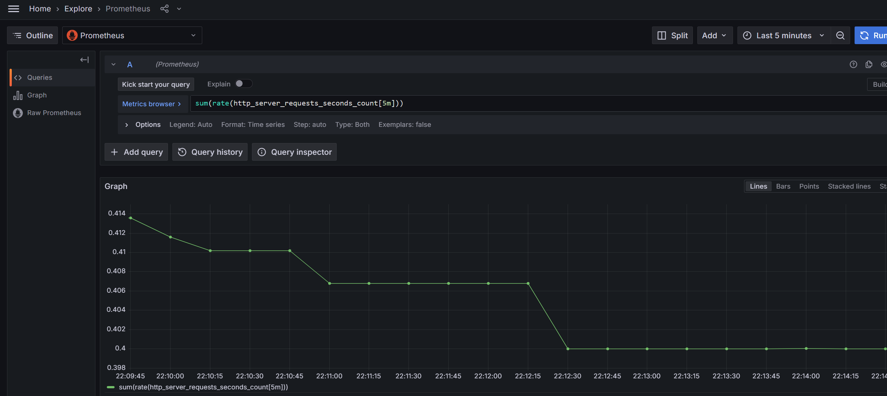
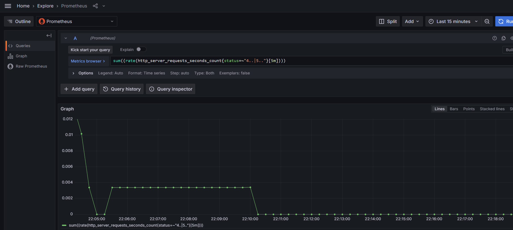
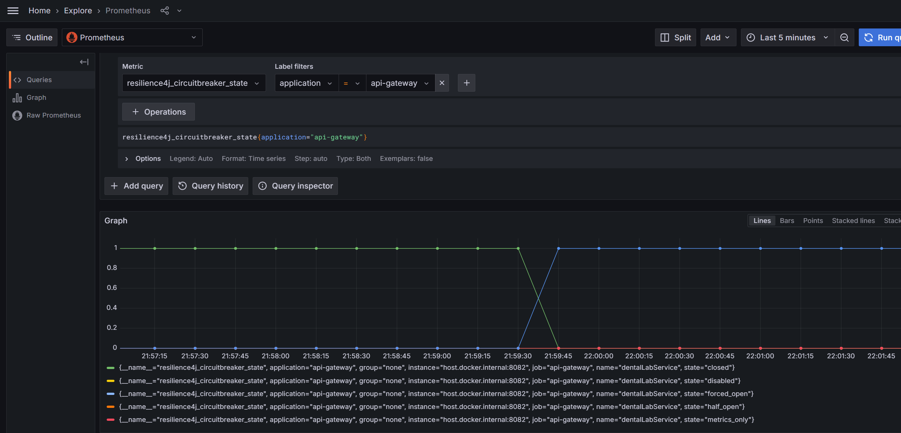
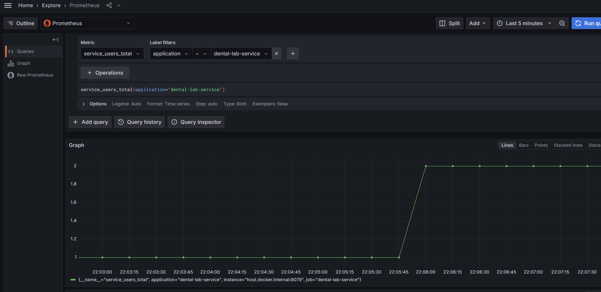
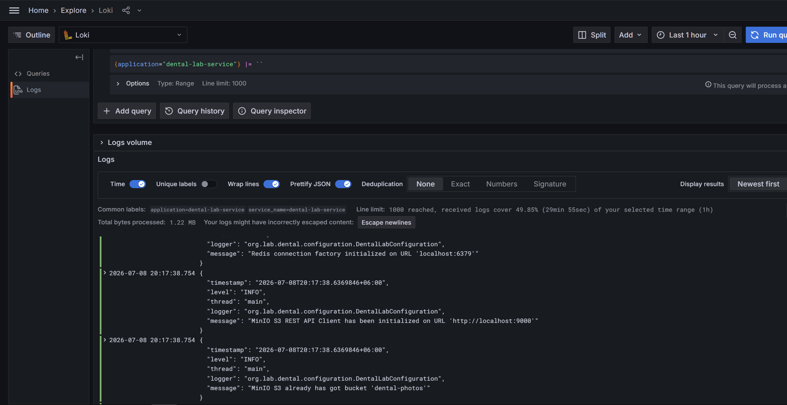
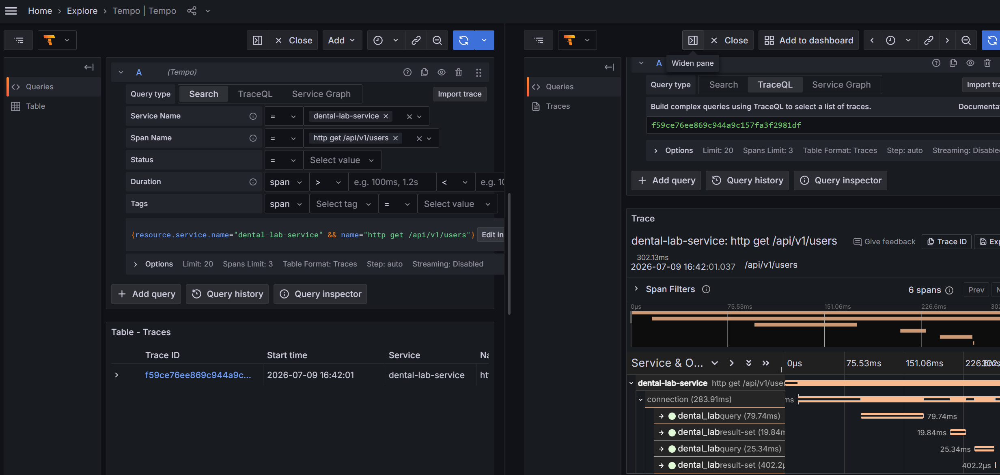

# Dental Lab Service

---
> ## О проекте

Веб-сервис для учёта заказов зубных техников. Позволяет вести каталог работ, управлять заказами, хранить фотографии выполненных работ, отслеживать статусы выполнения и формировать отчёты за выбранный период.

Проект был создан для ежедневной документации реального рабочего процесса зубных техников.

### Основные возможности

- Ведение персонального каталога зуботехнических работ с указанием стоимости.
- Запись и управление заказами (клиника, пациент, работы, даты, комментарии, статус).
- Загрузка и хранение фотографий выполненных работ.
- Расчёт дохода по месяцам с учётом статуса заказов.
- Экспорт и импорт отчётов в формате XLSX.
- Сортировка заказов по месяцам.
- Привязка Telegram-аккаунта к профилю пользователя и доступ к сервису через Telegram бот.
- Рассылка уведомлений о заказах на следующий день через Telegram или Email.
- Аутентификация и авторизация пользователей через Keycloak.

---
## [Open API](https://dental-lab-service.ru/docs/swagger-ui/index.html) 👈

_Swagger UI поддерживает OAuth2 Authorization Code Flow (PKCE).
Для авторизации достаточно выполнить вход через Keycloak, **client secret** пользователю не требуется_

---
> ## Версии проекта

Репозиторий содержит две ветки:

#### 1. `simple-release`

Упрощённая версия системы, предназначенная для развёртывания на VDS с ограниченными ресурсами.

**Особенности:**

- отсутствие централизованной наблюдаемости
- отсутствие брокера сообщений;
- отсутствие cloud-инфраструктуры;
- упрощённая схема взаимодействия сервисов;
- оптимизированное потребление памяти и вычислительных ресурсов.

Эта версия приложения развёрнута на VDS и доступна через домен [dental-lab-service](https://dental-lab-service.ru) с SSL-сертификатом и прокси Nginx.
###### [перейти к версии 👈](https://github.com/Stas-Kuprienko/dental-lab-service/tree/simple-release)

---
#### 2. `main`

Основная версия проекта, с расширением архитектурных и инфраструктурных решений.

**Дополнительно включает:**

- экосистему Spring Cloud;
- брокер сообщений RabbitMQ;
- инструменты мониторинга и трассировки;
- элементы отказоустойчивости приложения.

Данная ветка демонстрирует подход к построению распределённых приложений на базе Spring Boot и Spring Cloud.

---
> ## Технологический стек

- Java 21
- Spring Boot 3.5
- Spring Cloud 2025
- Spring Security
- API Gateway
- Resilience4J
- OpenFeign
- Apache POI
- Keycloak
- RabbitMQ

---
**Хранение данных**

- PostgreSQL
- Flyway
- Redis
- MinIO S3

---
**Интеграции**

- Telegram Bot API
- Email

---
**Observability**

- Micrometer
- Prometheus
- Loki
- Tempo
- Grafana

---
**UI**


- Thymeleaf

---
**Инфраструктура**

- Docker
- Nginx

---
**Сборка**

- Gradle

---
> ## Архитектура

Система состоит из нескольких независимых компонентов:
пользовательского `веб-интерфейса`, `Telegram-бота`, `backend-сервиса` и `инфраструктурных сервисов`.

Бизнес-логика сосредоточена в `Dental-Service`, а взаимодействие между компонентами осуществляется через `API Gateway` и `RabbitMQ`.
Аутентификация и авторизация осуществляется через сервис `Keycloak`.


---

[Файл диаграммы](docs/diagram.md)

---
> ## Технические решения

### RabbitMQ вместо Apache Kafka

Для асинхронного взаимодействия между сервисами выбран RabbitMQ.

Причины выбора:

- небольшой объём сообщений;
- отсутствие необходимости в event streaming;
- простота эксплуатации и меньшие требования к ресурсам;
- поддержка маршрутизации сообщений и Dead Letter Queue.

Для данного проекта использование Apache Kafka являлось бы избыточным решением.

---
### Динамическая модель данных таблиц

Каждый пользователь имеет собственный каталог изделий (ProductMap),
 который определяет набор доступных типов работ и их стоимость. На его основе динамически формируются:

* таблицы работ в Web UI (Thymeleaf);
* Excel-отчёты (XLSX Export);
* импорт данных из Excel (XLSX Import).

Благодаря этому разные пользователи могут работать с различающимися наборами изделий без изменения структуры базы данных и программного кода.

Импорт поддерживает загрузку Excel-файлов (по определённому шаблону), валидирует колонки и автоматически сопоставляет данные.

---
### Stateful Telegram Bot

Для поддержки многошаговых сценариев взаимодействия реализован механизм ChatSession.
```java
public class ChatSession {

    private Long chatId;
    private UUID userId;
    private Context context;

    public static class Context {

        private BotCommands command;
        private Map<String, String> attributes;
        private int step;
    }
}
```
При каждом запросе CommandHandler сохраняет в сессию текущую команду, шаг (у каждого CommandHandler свои шаги) и по необходимости атрибуты.

```java
    private SendMessage input(ChatSession session, Locale locale, String messageText, int messageId) {
    
        NewDentalWork newDentalWork = ... // парсинг сообщения в данные для объекта нового заказа
        InlineKeyboardMarkup keyboardMarkup = ... // создание ответа со списком видов работ
        
        //сохраняем в сессию введённые пользователем данные в формате JSON
        session.addAttribute(Attributes.NEW_DENTAL_WORK.name(), newDentalWorkAsString(newDentalWork));
        
        //устанавливаем текущую команду
        session.setCommand(BotCommands.NEW_DENTAL_WORK);
        
        //устанавливаем в сессию следующий шаг
        session.setStep(Steps.SELECT_PRODUCT_TYPE.ordinal());
        
        //сохраняем в Redis
        chatSessionService.save(session);
        
        return createSendMessage(session.getChatId(), text, keyboardMarkup);
    }
```
При новом запросе будет работать следующий шаг с использованием сохранённых в сессии данных.

---
### Dead Letter Queue

Для обработки ошибок доставки сообщений используется отдельная DLQ очередь.

Сценарий:

1. Dental Lab Service отправляет сообщение.
2. Telegram Bot обрабатывает сообщение.
3. При ошибке сообщение попадает в DLQ.
4. Dental Lab Service анализирует причину ошибки и выполняет альтернативные действия.

Например:

- отправка Email уведомления;
- запись метрики;
- логирование инцидента.

---
### Keycloak вместо собственной реализации авторизации

Для аутентификации и авторизации используется Keycloak.

Причины выбора:

- поддержка OAuth2 и OpenID Connect;
- централизованное управление пользователями;
- поддержка ролей и политик доступа;
- готовая интеграция со Spring Security.

Это позволяет сосредоточиться на бизнес-логике приложения, не реализуя собственный Identity Provider.

---

### Виртуальные потоки для оптимизации многопоточности

```java

    @Bean(name = "virtualThreadPerTaskExecutor")
    public ExecutorService virtualThreadPerTaskExecutor() {
        this.executorService = Executors.newVirtualThreadPerTaskExecutor();
        return executorService;
    }

    @Bean(name = "taskExecutor")
    public AsyncTaskExecutor taskExecutor() {
        return new ConcurrentTaskExecutor(virtualThreadPerTaskExecutor());
    }
```

---
> ## Observability

В проекте реализован полный цикл наблюдаемости приложения.

### Метрики

**Prometheus + Micrometer**

Ведётся учёт:

* `HTTP latency`
  
---
* `Количество запросов`
  
---
* `Ошибки`
  
---
* `Resilience4J`
  
---
* `Бизнес-метрики`
  
---
### Логи

**Loki + Promtail**

Централизованно собираются структурированные JSON логи.

  

### Трассировка

**OpenTelemetry + Tempo**

Поддерживается сквозная трассировка запросов между сервисами по Trace ID.

  

### Визуализация

**Grafana Dashboard**

---
> ## Скриншоты

| **Привязка Telegram к профилю сервиса**                              | --- | **Создание вида работы в каталог**                                   |
|:---------------------------------------------------------------------|-----|:---------------------------------------------------------------------|
|  |     |  |
---

**Динамическая таблица и карта работ**


---

**Импорт excel файлов**


---

**Отображение статусов в таблице**


---
> ## Запуск проекта

**Требования**

- RAM: 12+ GB
- CPU: 4+ cores 
- Disk: 15+ GB
- Docker engine - version 26+
- Docker compose V2+
- Java 21 (для запуска проекта через IDE)

#### Моменты, которые нужно учесть 

* При запуске приложения **Dental-service** будет включён режим `mock-mode` для рассылки.
 Чтобы включить реальную рассылку по Email, нужно настроить smtp и указать данные в переменных! (`application.yaml: project.mail.*`)
 и выключить режим `mock-mode` (`project.mailing.mock-mode.email: false`)

* Для запуска **Telegram-bot** требуется создать собственного бота через [BotFather](https://t.me/BotFather) и указать bot-name и token в переменных! (`application.yaml: project.variables.telegram.*`).
 Для включения рассылки через Telegram, нужно отключить режим `mock-mode` в приложении **Dental-service** (`project.mailing.mock-mode.telegram: false`).
* Также для запуска **Telegram-bot** может понадобиться настройка параметров прокси для доступа через VPN! (`application.yaml: project.telegram.proxy.*`)

* Но **Telegram-bot** можно не запускать — приложение полностью работоспособно без него.

* Для запуска **Config-server** нужно создать репозиторий с конфигурациями в GitHub, создать токен для этого репозитория
 и указать переменные в `config-server:appliction.yaml:project.variables.git.*`.

* Но **Config-server** можно не запускать — приложение полностью работоспособно без него.

**Локальный запуск**

* Скачать проект [в виде архива](https://github.com/Stas-Kuprienko/dental-lab-service/archive/refs/heads/master.zip) или через `git clone https://github.com/Stas-Kuprienko/dental-lab-service.git`.

1. Если скачивали Zip архив: Извлечь из архива проект.
2. Если клонировали через Git: Перейти в директорию `cd dental-lab-service`, затем переключить ветку `git checkout simple-release`

* Открыть директорию `dental-lab-service` как проект в IDE.

* Запустить инфраструктурные компоненты через [docker-compose](docker-compose.local.yml)
  `docker compose -f docker-compose.local.yml -d up` с укороченной и упрощённой конфигурацией.

* Затем запустить через IDE `config-server`(_необязательно_), `api-gateway`, `dental-service`, `ui-mvc-app` и `telegram-bot`(_необязательно_).

* Открыть [страницу UI](http://localhost:8081) локального приложения или [open API](http://localhost:8082/docs/index.html).
  [Страница Keycloak](http://localhost:8080) админ консоли, [страница Grafana](http://localhost:3000) с визуализацией метрик, логов и трассировкой.

---
> ## Автор

### Станислав Куприенко

[GitHub](https://github.com/Stas-Kuprienko)

[Telegram](@Stas_Kuprienko) 