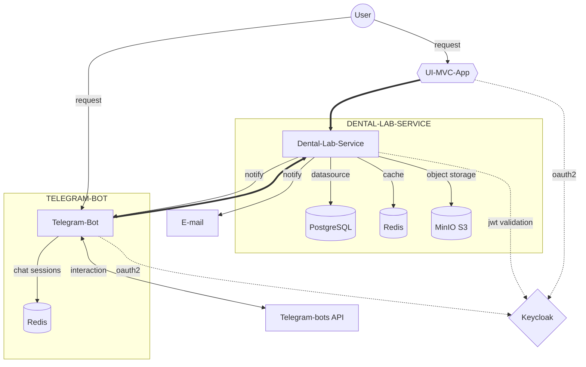

```mermaid
flowchart TD

    subgraph DENTAL-LAB-SERVICE
        DLS[Dental-Lab-Service] --> |datasource| PG[(PostgreSQL)]
        DLS --> |cache| RDS[(Redis)]
        DLS --> |object storage| S3[(MinIO S3)]
    end

    subgraph TELEGRAM-BOT
        TG[Telegram-Bot] ==> DLS
        TG --> |chat sessions| RDS2[(Redis)]
    end
    
    TG <--> |interaction| TG-API[Telegram-bots API]

    USER((User)) --> |request| UI{{UI-MVC-App}}
    USER --> |request| TG

    UI ==> DLS

    DLS --> |notify| EMAIL[E-mail]
    DLS --> |notify| TG

    DLS -.-> |jwt validation| KC{Keycloak}
    UI -.-> |oauth2| KC
    TG -.-> |oauth2| KC

```