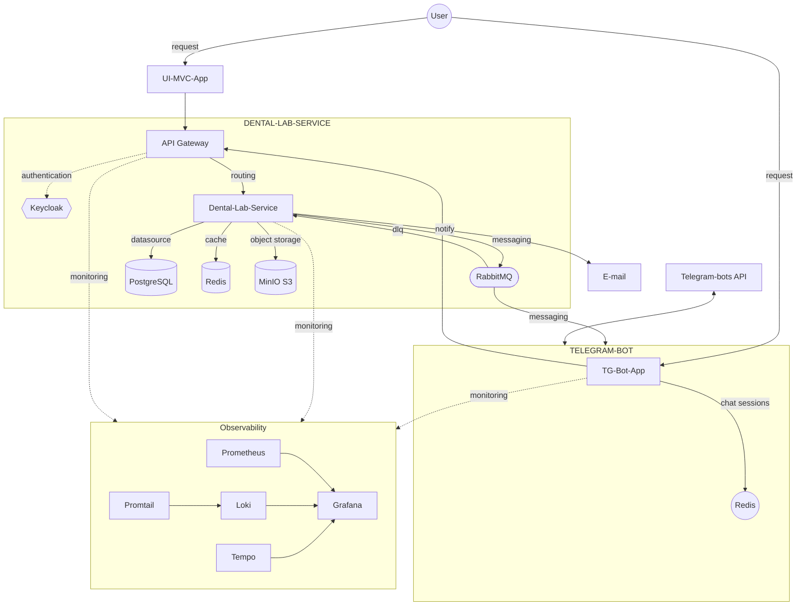

```mermaid
flowchart TD
    
    USER((User)) --> |request| UI[UI-MVC-App]
    USER --> |request| TG[TG-Bot-App]
    
    UI --> API[API Gateway]

    subgraph DENTAL-LAB-SERVICE
        API -.-> |authentication| KC{{Keycloak}}
        API --> |routing| DLS[Dental-Lab-Service]
        DLS --> |messaging| RMQ([RabbitMQ])
        RMQ --> |dlq| DLS
        DLS --> |datasource| PG[(PostgreSQL)]
        DLS --> |cache| RDS[(Redis)]
        DLS --> |object storage| S3[(MinIO S3)]
    end
    
    DLS --> |notify| EMAIL[E-mail]

    subgraph TELEGRAM-BOT
        TG --> API
        TG --> |chat sessions| RDS2((Redis))
    end

    RMQ --> |messaging| TELEGRAM-BOT
    TG-API[Telegram-bots API] <--> TELEGRAM-BOT

    DLS -.-> |monitoring| Observability
    API -.-> |monitoring| Observability
    TG -.-> |monitoring| Observability

    subgraph Observability
        PROM[Prometheus] --> GR[Grafana]
        LOKI[Loki] --> GR
        PMT[Promtail] --> LOKI
        TEMPO[Tempo] --> GR
    end
```