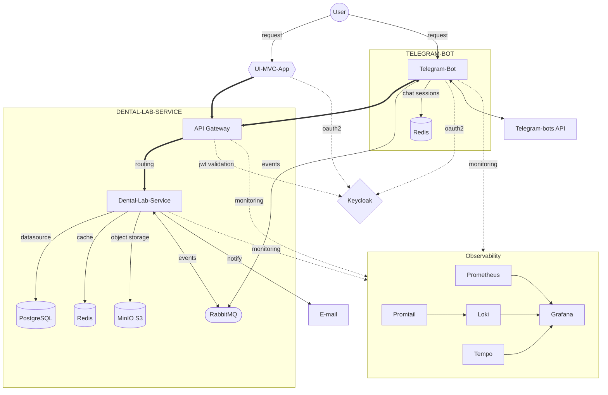

```mermaid
flowchart TD

    subgraph DENTAL-LAB-SERVICE
        API[API Gateway] ==> |routing| DLS[Dental-Lab-Service]
        DLS --> |datasource| PG[(PostgreSQL)]
        DLS --> |cache| RDS[(Redis)]
        DLS --> |object storage| S3[(MinIO S3)]
        DLS <--> |events| RMQ([RabbitMQ])
    end

    subgraph TELEGRAM-BOT
        TG[Telegram-Bot] ==> API
        TG <--> |events| RMQ
        TG --> |chat sessions| RDS2[(Redis)]
    end

    USER((User)) --> |request| UI{{UI-MVC-App}}
    USER --> |request| TG

    UI ==> API

    API -.-> |jwt validation| KC{Keycloak}
    UI -.-> |oauth2| KC
    TG -.-> |oauth2| KC
 
    DLS --> |notify| EMAIL[E-mail]

    DLS -.-> |monitoring| Observability
    API -.-> |monitoring| Observability
    TG -.-> |monitoring| Observability
    
    TG <--> TG-API[Telegram-bots API]

    subgraph Observability
        PROM[Prometheus] --> GR[Grafana]
        LOKI[Loki] --> GR
        PMT[Promtail] --> LOKI
        TEMPO[Tempo] --> GR
    end
```